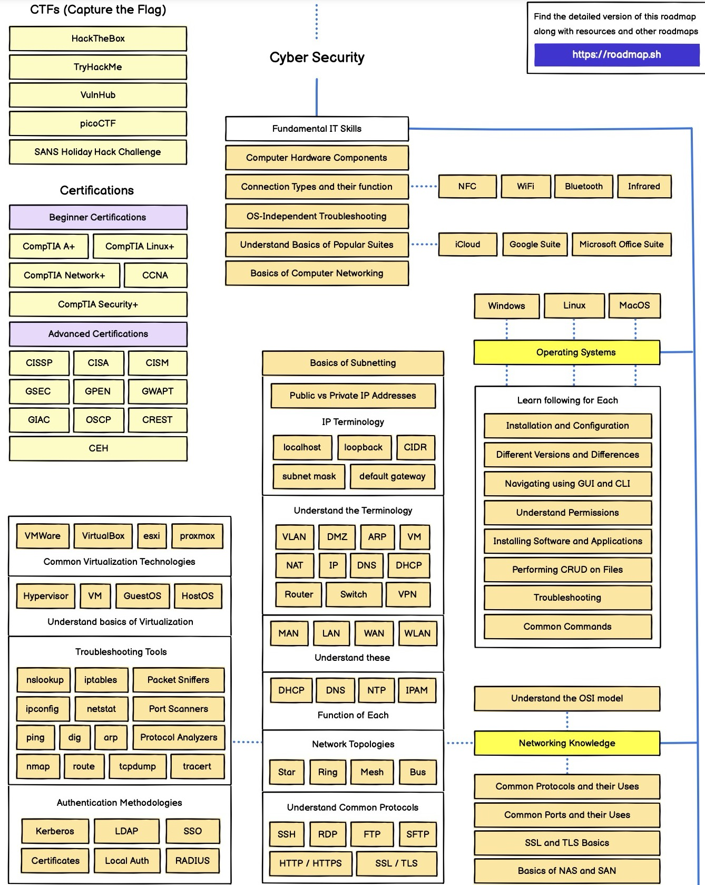
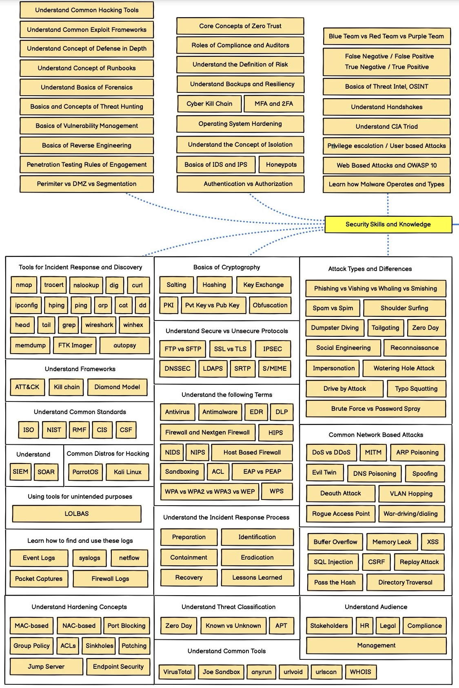

# **General :** 
### Cryptography
### Networking
### Operating Systems
### Virtualization
### Version Control
### Reports Writing
### Cybersecurity Jobs
### Regulations and Compliance
# **Red Team :**
### Web Exploitation
### Reconnaissance / Information Gathering
### Scanning
### Enumeration
### CVEs Exploitation
### Security Systems Evasion
### System Hacking
### Network Evasion
### Host Evasion
### Post Compromise
### Social Engineering
### Wireless Networks
### Mobile and IoT Hacking
### Vulnerability Analysis
### Malwares
### Denials of Service
### Cloud Hacking
### Physical Pentesting
# **Blue Team :**
### Incident Response
### Security Monitoring & Detection
### Log Analysis
### Digital Forensics
### Vulnerability & Patch Management
### Threat Hunting
### Network Security
### Software Security
### Endpoint Security
### Security Data Management
### Identity & Access Management (IAM)
### Cloud Security
# **Glossary :**
# **Tools :**
# **Skills Table :**

